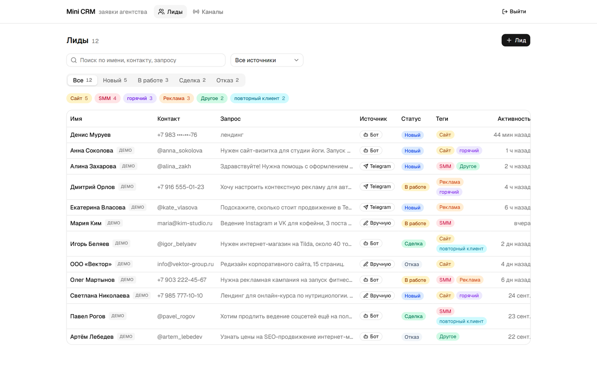
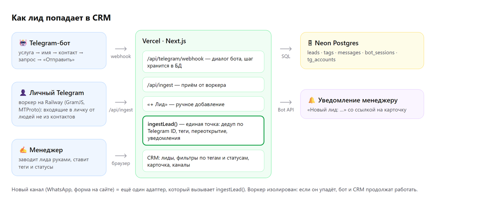

# Mini CRM — заявки агентства

**Демо:** https://agency-mini-crm.vercel.app (пароль выдаётся вместе с заданием) · **Бот:** [@testovoebbbbbot](https://t.me/testovoebbbbbot)

Мини-CRM, куда сами собираются лиды агентства:

1. **Из Telegram-бота.** Человек пишет боту, бот собирает заявку (услуга → имя → контакт → запрос), лид появляется в CRM с тегом услуги, без перезагрузки страницы.
2. **Из обычного Telegram.** Входящие в личку менеджера становятся лидами. Основной способ — **Telegram Business**: владелец привязывает бота в «Настройки → Telegram для бизнеса → Чат-боты», и Telegram пересылает боту личные сообщения (официальный API, тот же webhook, без отдельного сервиса). Запасной — **userbot** (`worker/`, GramJS/MTProto) для аккаунтов без Premium: вход по номеру прямо из CRM.
3. **Вручную.** Кнопка «+ Лид».
4. **Теги и статусы.** Теги вешаются и снимаются в карточке, список фильтруется по тегу, статусу, источнику и поиску. Фильтры живут в URL.

Плюс уведомления менеджеру в Telegram о новых лидах и страница «Каналы» со статусом бота и подключённого аккаунта.



## Архитектура

```
 Клиент ─► @бот ──webhook──►┐
                            │   Vercel: Next.js 16 ───────────► Neon Postgres
 Клиент ─► личный Telegram ─┤   ├ /api/telegram/webhook  бот + Telegram Business
           менеджера        │   ├ /api/ingest   ◄── приём от userbot-воркера
                            │   └ CRM UI за паролем
 (запасной путь) Railway: worker (GramJS, MTProto) ─► /api/ingest
```

- **Одна точка входа лида: `ingestLead()`** (`src/lib/leads/ingest.ts`). Бот, воркер и ручное добавление проходят через неё. Дедуп, теги, переоткрытие закрытого лида и уведомления живут только там. Новый канал (WhatsApp, форма на сайте) = новый тонкий адаптер.
- **Дедуп по Telegram user id.** Один человек = одна карточка, даже если писал и боту, и в личку. Повторные обращения попадают в историю карточки.
- **Serverless-безопасный бот.** Шаг диалога хранится в БД (`bot_sessions`). Ретраи Telegram отсекаются по `update_id`. Лид не задваивается благодаря `externalId`. Кнопки привязаны к номеру черновика, поэтому старая кнопка «Отправить» не перехватит новую заявку. Webhook настроен с `max_connections: 1`: Telegram доставляет апдейты по одному, и состоянию диалога не нужны блокировки. Для MVP этого хватает, при росте нагрузки — advisory-lock на чат.
- **Изоляция отказов.** Воркер — отдельный сервис. Если он упадёт, отвалится только пункт 2, а бот, CRM и ручной ввод продолжат работать. После рестарта воркер догоняет непрочитанные сообщения.



Подробнее: [дизайн](docs/superpowers/specs/2026-10-01-mini-crm-design.md), [план и контракты модулей](docs/superpowers/plans/2026-10-01-mini-crm-plan.md), [воркер](worker/README.md).

## Стек

Next.js 16 (App Router), React 19, TypeScript, Tailwind 4 + shadcn/ui, Drizzle ORM + Neon Postgres, grammY. Воркер: Node 22 + GramJS. Тесты: Vitest, интеграционные — на PGlite (Postgres в процессе, без Docker).

## Локальный запуск

```bash
npm install
cp .env.example .env.local     # заполнить DATABASE_URL и секреты
npm run db:migrate             # схема
npm run db:seed                # демо-лиды (необязательно)
npm run dev                    # http://localhost:3000, пароль — CRM_PASSWORD
npm test                       # тесты CRM
```

Боту нужен публичный HTTPS-адрес для webhook: после деплоя выполнить `npm run bot:set-webhook` с `APP_URL` продакшена.

Воркер: `cd worker && npm install && cp .env.example .env && npm run dev`, подробности в `worker/README.md`.

## Структура

| Путь | Что там |
|---|---|
| `src/lib/leads/ingest.ts` | ядро: создание и слияние лидов |
| `src/lib/bot/flow.ts` | диалог бота — чистый автомат без Telegram и БД |
| `src/lib/bot/bot.ts` | проводка grammY: сессии в БД, эффекты, клавиатуры |
| `src/lib/leads/queries.ts` | выборки и правки для UI |
| `src/app/` | страницы CRM и API-роуты |
| `src/proxy.ts`, `src/lib/auth.ts` | вход по паролю (HMAC-cookie) |
| `worker/` | userbot: вход по номеру, приём сообщений, heartbeat |
| `drizzle/` | миграции |
